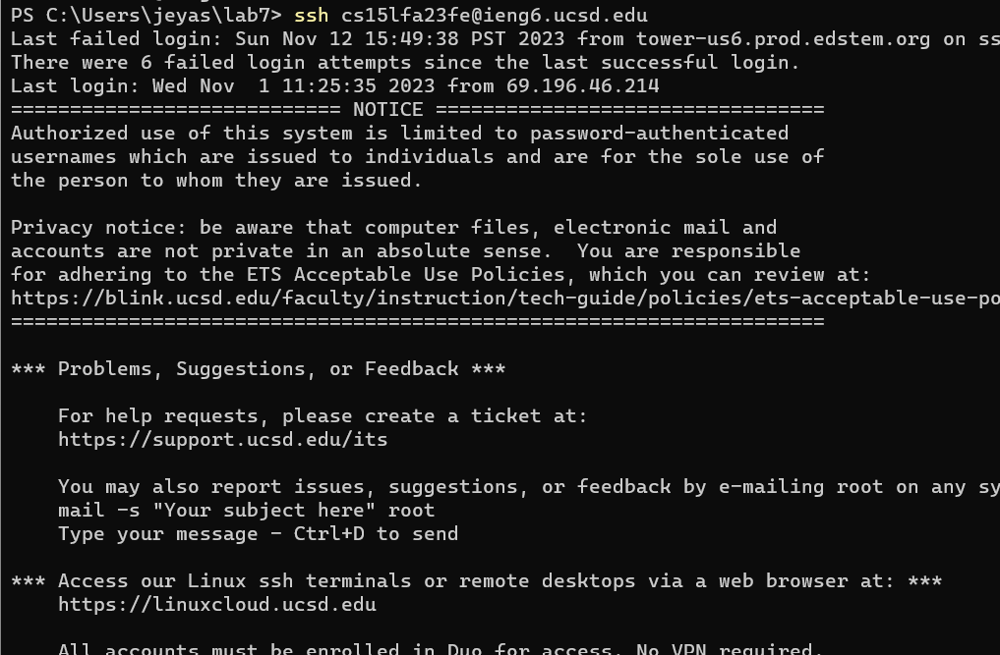
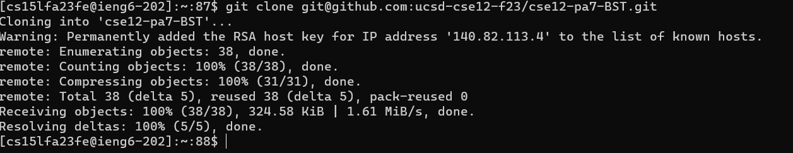
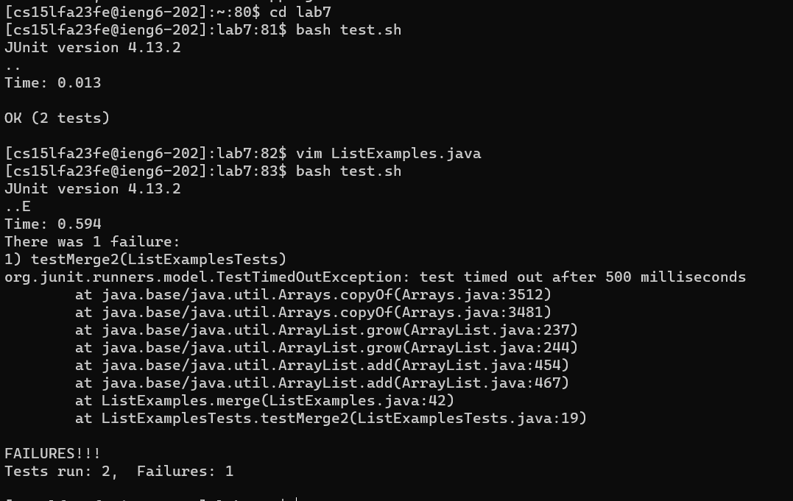
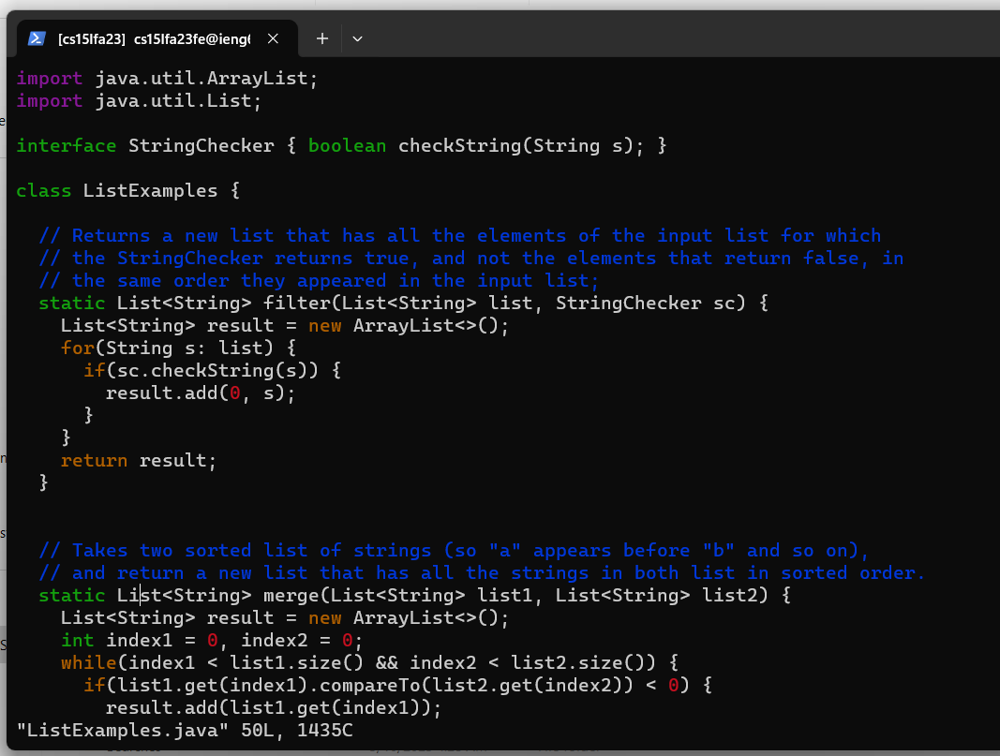
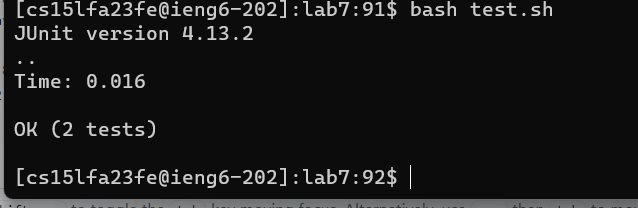
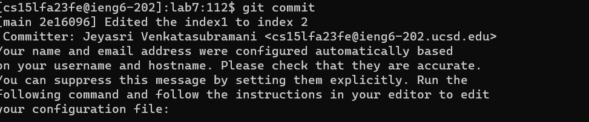
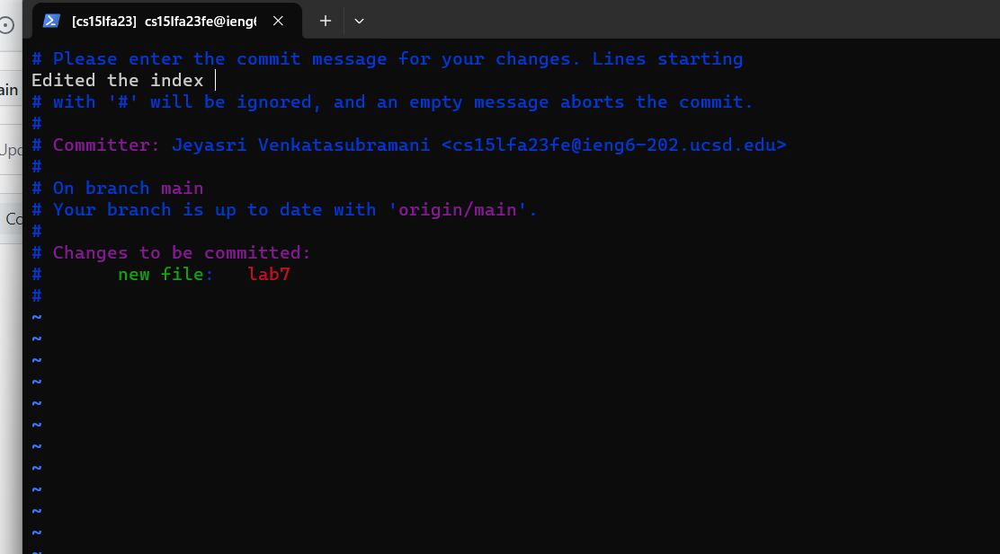
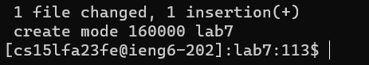

**Step 4:** `ssh cs15lfa23fe@ieng6.ucsd.edu` \<enter>  
I just typed out the ssh command to login to my ieng6 account  
 

**Step 5** 'git clone git@github.com:ucsd-cse12-f23/cse12-pa7-BST.git'<enter>  
I just typed out the command to git clone the forked respository onto my account cloud.  
 

**Step 6:** running the tests 
cd lab7\<enter>  
I changed my directory so I would be in the lab7 folder. Enter caused the command to run.  
bash test.sh\<enter>  
I ran the shell script that is used to test the ListExamples.java file  
 

**Step 7** edit the ListExamples.java file 
vim ListExamples.java<enter>  
i (go into insert mode)  
\<down> x37 \<right> x12 <backspace> 2 (editing the file) 
\<esc> (get out of insert mode) 
:wq (saves and exits from vim)  

**Step 8** re run the tests  
\<up> x2 (this went up my command history to get to the bash test.sh command)  

**Step 9:** commit and push to git hub account  
git add ListExamples.java \<enter>  
this moves the file to the staging area 
  

git commit \<enter>  
this moves/commits the file into the github repository  
  
and prompts for a commit message where I included changed index1 to index2 
  
then I clicked \<esc> and :wq to exit insert mode and save and exit from vim respectively  
  
